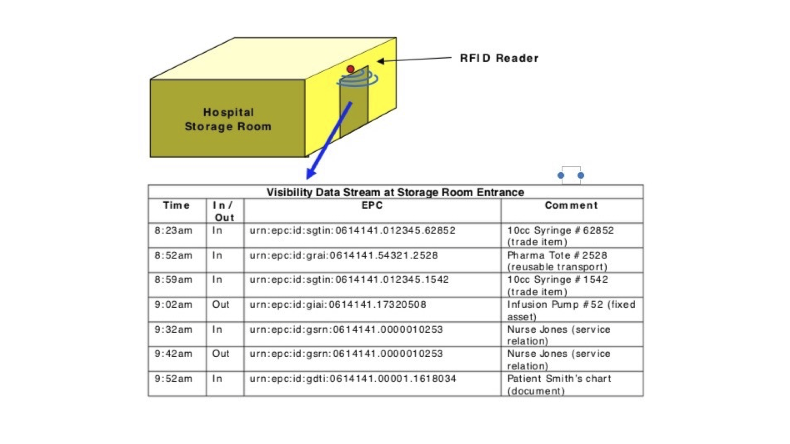

As typical RFID manufacturers we are used to the nuances of tag banks and antenna powers and scan rates. What we are much more likely to have missed crossing paths with is two standards, Global Standard 1 (GS1) and the Electronic Product Code (EPC). In this article I will give you a brief introduction to these standards and show how our raw RFID data gets transformed as it moves through the business process hierarchy.


GS1 and the EPC RFID Tag standards are both relatively long-lived standards. The GS1 standard grew out of the Universal Product Code (UPC) standardization effort in the early 70’s which tried to make the business of grocery shopping easier and more automated. 


As European and global efforts at standardization coalesced, they resulted in the forming of GS1. GS1 now has a range of standards, not just at the physical level (eg barcodes and RFID tags), but at the data model and business process level as well. 

The prime example of this is the Electronic Product Code Information Services (EPCIS) which specifies the creation and sharing of event information at these higher levels of abstraction. The idea is to be able to specify **what** was observed, **when** it was observed, **where** the entity was observed, and **why**. The last is really a convenient alliteration, you can interpret this as contextual information about the event, and its often supplied by processing layers above the bare observation.


The handling of EPCIS data at the RFID tag level is specified is specified by the EPC RFID Tag specification.


The idea of the EPC is very simple. Provide a unique identifier for physical objects that are involved in any business process. This unique identification is the electronic product code or EPC. EPC tags are meant to be unique across all objects, over all time and over all categories of physical events.


GS1 identification keys identify categories of objects, locations, etc. There is a well-defined correspondence between EPC & GS1 keys so that objects with GS1 keys can be used in the EPC context. 


EPC SGTIN Identifiers , which are the most common kind, are of the form:
```
 <epc>urn:epc:id:scheme:mfg-prefix:item-ref:serial-no </epc> 
 ```
 where


_<epc>urn:epc:id:_        - identifies the context as all physical objects


_scheme_                - identifies the particular scheme that is being used. It enables the mapping of GS1 identifiers into the EPC space. 


_mfg-prefix_                - The GS1 Company Prefix, assigned by GS1 authorities.

_item-ref_                - Typically assigned by the company eg a product type

_serial-no_                - The serial number assigned to an individual object 


For some of the tag types described below, the fields may vary, eg a location code etc. Some examples of schemes (their usage is fairly obvious) are:


sgtin                 - trade item identification (Serialised Global Trade Item Number)

sscc                - logistic unit (Serial Shipping Container Code)

sgln                - location (Global Location Number)

grai                - returnable asset (Global Returnable Asset Identifier)

giai                - fixed asset (Global Individual Asset Identifier)

gtdi                - document (Global Document Type Identifier


There are 14 such schemes specified in the EPC Tag Data Standard.        


EPC identifiers are mapped into RFID Tags through a set of complex encoding and decoding rules. This typically happens in an edge device or gateway that the RFID reader is connected to.


If you also provide some business context at the edge device, the generated EPC identifiers can be wrapped into an EPC event specification which is encoded as an XML message, and can be directly sent to and use by a business system such as SAP>


Here is a simple example taken from the standard to help understand these concepts. Here the raw RFID data is converted to an EPC identifier (URN). You can see how the range of tags allows the generation of a complete picture of the flow of transactions in the hospital storage room.
  



Knowing how your RFID reader data is integrated into your customer’s business process can help you make a stronger case for your product.


Good luck !