> This post continues from our earlier post on [AWS IoT, Timestream and Quicksight](/blog/metal-to-alerts-with-aws-iot-elasticsearch-kibana). We replace Timestream and Quicksight with ElasticSearch and Kibana.

## Why

ElasticSearch and Kibana are, _probably_, the most commonly used stack for data analysis and visualisation. ElasticSearch is a notoriously difficult software to host and manage yourself. The managed service from AWS has long been one of the more reliable options along side the managed cloud from [Elastic.co](https://elastic.co), the creators of ElasticSearch. 

A lot of necessary features like authentication and alerts were only available in the enterprise edition. Until, that is, the release of Open Distro For ElasticSearch by AWS. While causing a [great deal of controversy and ethical dilemma](https://news.ycombinator.com/item?id=19359602), ODFE adds authentication, access control, alerts, anomaly detection and, now, notebooks to the open source version release.

This makes ElasticSearch and Kibana:

- more complete than Timestream & QuickSight with alerts and notebooks in the same UI
- more capable than Timestream & Grafana with anomaly detection and notebooks
- more extensible than using Timestream alone with the ability to ingest all kinds of data - not just timeseries. 


## What are we going to build?

We will:

1. Use everything we built up to step 3 of our [previous post](/blog/metal-to-alerts-with-aws-iot-elasticsearch-kibana).
2. Set up an AWS IoT rule to route shadow updates to ElasticSearch
3. Use Kibana to create visualisations and alerts


## Create ElasticSearch Instance

We will use the [AWS ElasticSearch service](https://aws.amazon.com/elasticsearch-service/) that sets up ElasticSearch and Kibana with ODFE. Since, this is just a demo we will set up a single `t2.small` node with `10GB` disk size under `Deployment type = Development and testing`. We will use version `7.9` of ElasticSearch which is the latest on the service as of this writing. 

> AWS seems to be tracking the releases much better these days. The latest release on `Elastic.co` is `7.10.1`.

**CRITICAL SECURITY NOTE**

Make sure you read through the notes on network configuration and fine-grained access control for ODFE (not available for `t2.small`). For a production system, you should use an instance larger than `t2.small` to support encryption at rest and, by extension, access control. 

I am using `Public access` here for the purposes of the demo as this instance will be live only for a couple of hours. Google ElasticSearch breaches for the ever increasing counts of exposed servers. 

### Create Index and Mapping

An `index` is the highest logical level within ElasticSearch. Think of these as similar to tables in a database. 

- You need an `index` before ingesting data. 
- You *do not* need data columns and types to be defined before ingestion.
- You need to define `mappings` for specific columns that you want to transform during ingestion. 
- You **need** types and columns defined before analysis or visualisation.

Creating an index needs an HTTP `PUT` as shown below:

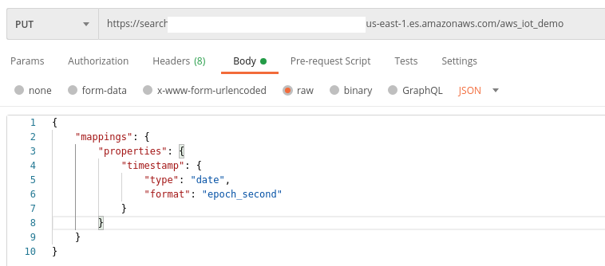

Note that we are specifying in the mapping that our `timestamp` field should be interpreted by ElasticSearch as a `date` (really, datetime) field.

That's it, our ElasticSearch instance is ready to receive data.

## Persisting Shadow Updates

Go to `AWS IoT Core -> Act -> Rules` to get started. We will create a new rule `SendShadowsToElasticSearch`. Like before, we will add a `filter` and an `action`. 

### Filter

We will need add back the `timestamp` field and we will also need the `device_id`. So, our SQL query will now look like this:

```sql
SELECT 
  state.reported.cpu_usage as cpu_usage,
  state.reported.cpu_freq as cpu_freq,
  state.reported.cpu_temp as cpu_temp,
  state.reported.ram_usage as ram_usage,
  state.reported.ram_total as ram_total,
  state.reported.timestamp as timestamp,
  clientid() as device_id
FROM '$aws/things/+/shadow/update'
```

### Action

ElasticSearch is a first class citizen in the AWS IoT actions list. So, let's select that action and configure it:

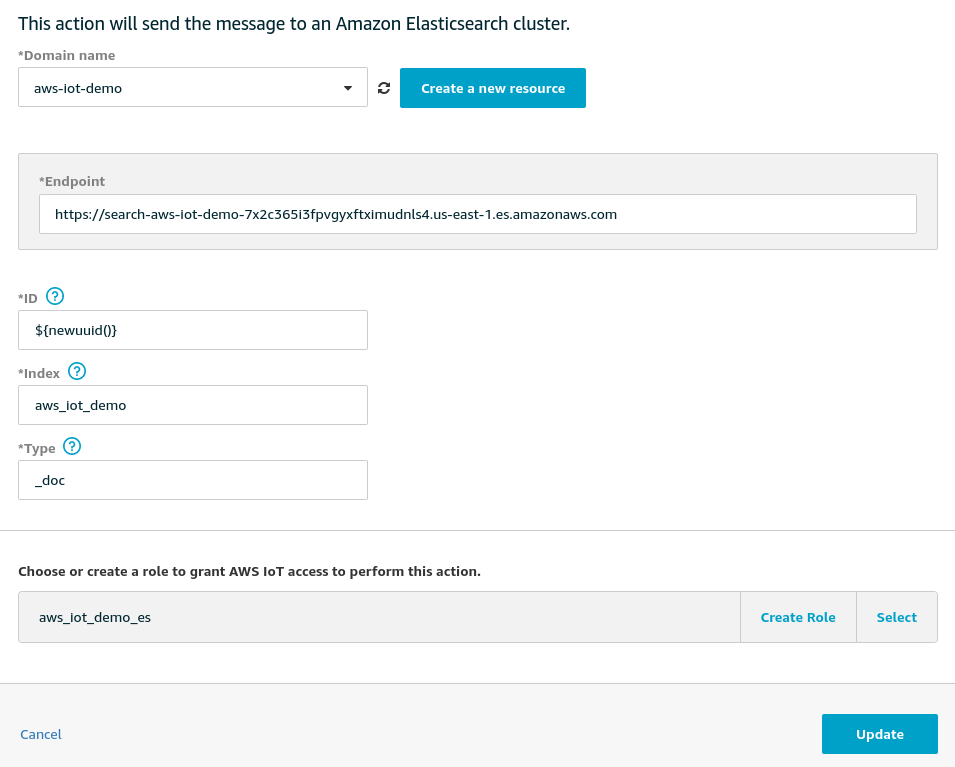

Note that we:

- Selected the ElasticSearch instance we created in the previous step
- Granted access to AWS IoT via an IAM rule
- Added an `id` using the built-in `newuuid()` function
- Specified our index
- Specified a type `_doc` for our data which is the default built-in type for new documents


As before, we will enable the `CloudWatch` action in case of errors.

Our rule will finally look like this:

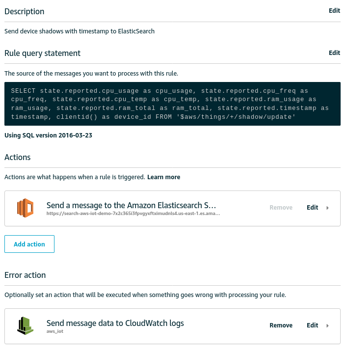


## Querying and Visualisation Using Kibana

Let's start our simulators again and hop over to the Kibana to start analysing our data. The Kibana URL will be visible in your AWS ElasticSearch Console and should just be `https://ES_DOMAIN/_plugin/kibana/`. 

Before we can query the data, we need to create an [`index pattern`](https://www.elastic.co/guide/en/kibana/current/index-patterns.html). Kibana should prompt you to create an index pattern as soon as you enter. If you missed that, go to `Stack Management --> Index Patterns` from the left sidebar. 

Click on `Create index pattern` and walk through the wizard. Since your index has been receiving some data, the columns will already be detected. Ensure that you select `timestamp` as your date field.

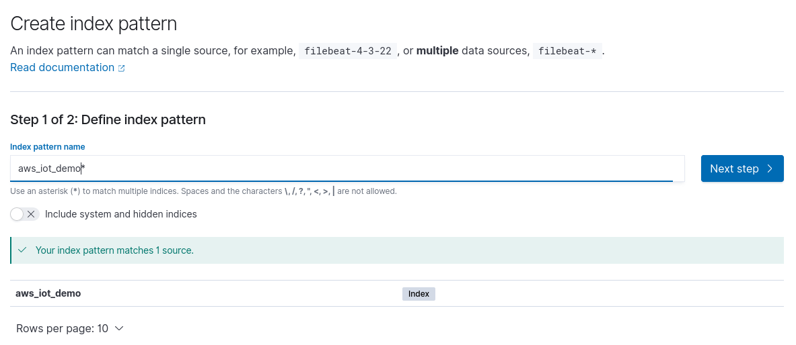

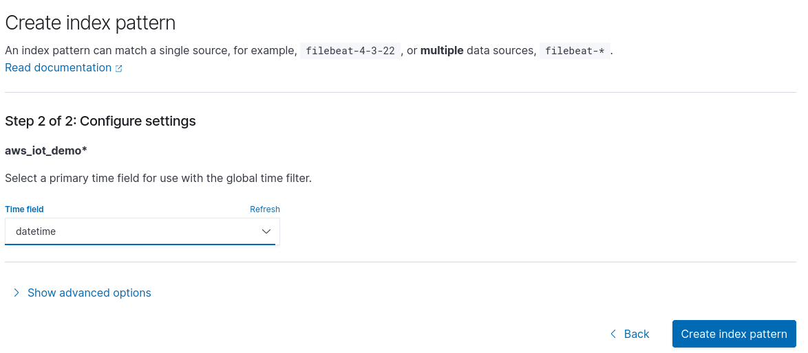

### Discover

With the index pattern in place, go to `Discover` in the sidebar to see your data streaming in. 

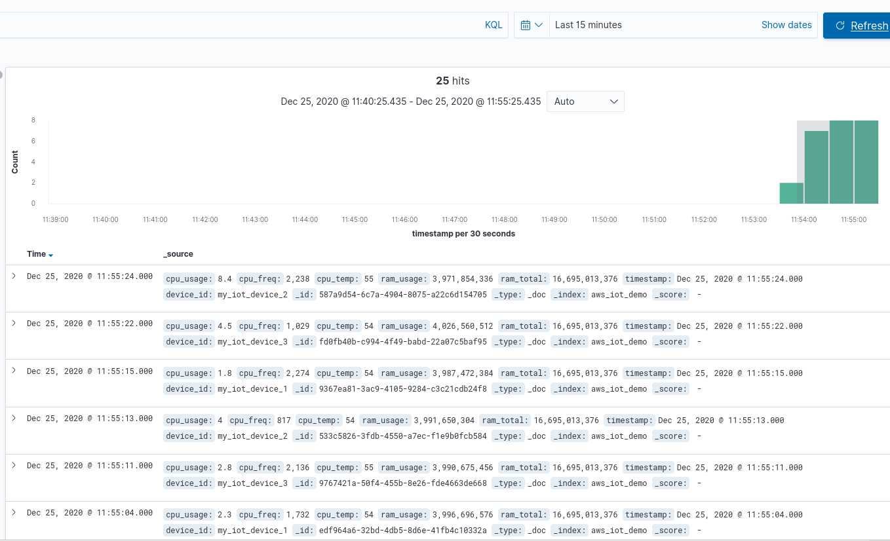


If you do see similar output, we can continue to visualisations. If you don't,

- Check the Cloudwatch Logs for errors
- Verify that your SQL syntax is correct - especially the topic
- Ensure your Rule action has the right index and an appropriate IAM Role
- Verify that your Device Shadow is getting updated by going over to AWS IoT -> Things -> my_iot_device_1 -> Shadow
- Look for errors if any on the terminal where you are running the script.

### Visualisations & Dashboard

Once we start receiving data, visualisations within Kibana are easy to set up. Go to `Visualisations` in the sidebar and create a line chart for each of our metrics. Specifically,

- Select the index `aws_iot_demo` as data source
- For the Y-axis, select `average` as the aggregation and the metric, e.g. `cpu_usage` under field. Give a custom label for the axis if you want.
- To enable timeseries visualisation, add an X-axis bucket with aggregation `Date Histogram`, field `timestamp` and `Auto` interval.
- To enable distinction by `device_id`, add another bucket, this time with sub-aggregation `Terms`, field `device_id.keyword` and the default Order By options. 
  - `device_id.keyword` indicates that ElasticSearch is indexing the strings stored in the `device_id` column.

Click on `Update` and your chart should look similar to this:

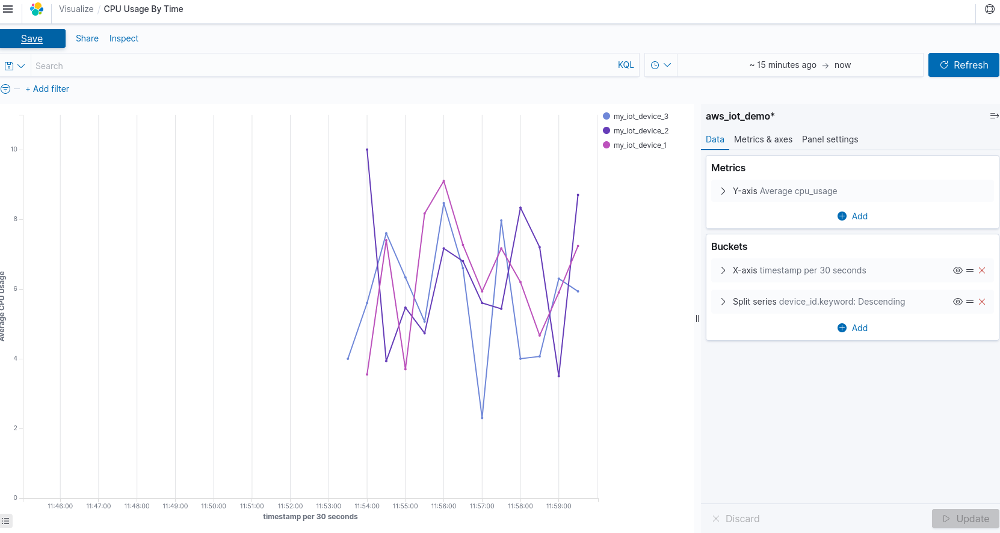

Create visualisations for the other metrics and add them to a `Dashboard` from the sidebar.  Your dashboard should look something like this:

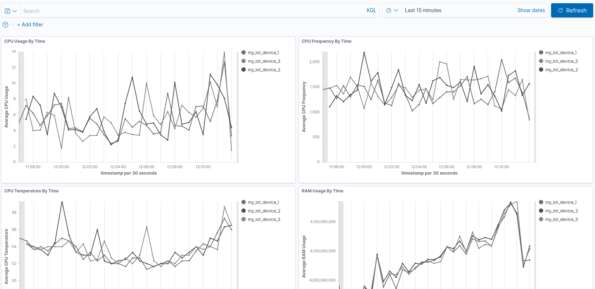


Unlike QuickSight, Kibana dashboards can be embedded on websites as snapshots. 

### Alerts

Alerts in Kibana are independent of visualisations, unlike Grafana. They are created in two stages: **monitors** and **triggers**.

### Monitors
Monitors are queries that run on a schedule. Something like the one shown below. Queries can be defined using the UI/Visual Graph, via an [extraction query](https://opendistro.github.io/for-elasticsearch-docs/docs/alerting/monitors/) or even, excitingly, anomaly detection (more on this in the next section).

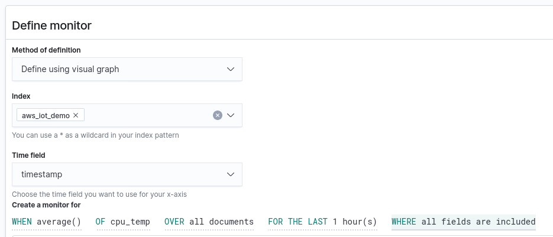

### Triggers
Triggers compare the value returned by the monitor with specific thresholds. If the threshold is crossed, triggers can notify certain endpoints. At the moment, the built-in destinations are limited to `Amazon SNS`, `Amazon Chime`, `Slack` and `Custom webhook`. We will create a trigger without a destination so we can see the alerts in the UI.

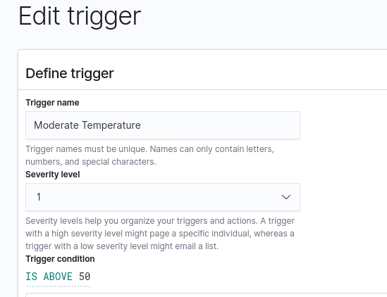


Once an alert has been triggered, it will be activated and will show up on the Alerts Dashboard. `Active` alerts can be `Acknowledged` to let the system know that an operator is looking into the issue. Once the metric/query is no longer in breach of the threshold, the alert is `Completed`. For a detailed description, check [the docs](https://opendistro.github.io/for-elasticsearch-docs/docs/alerting/monitors/#work-with-alerts).

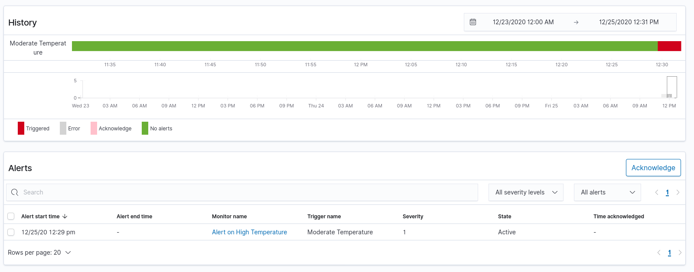


### Anomaly Detection
Anomaly detection is a relatively new feature in ODFE and is getting frequent updates. As of release `7.9` on AWS, you can set up 

- `detectors` that query all or some portion of your data at regular intervals, and
- `models` that monitor specific fields or custom queries for anomalies.

We will explore this feature in detail in a future post. For now, see [this post](https://opendistro.github.io/for-elasticsearch/blog/odfe-updates/2019/11/real-time-anomaly-detection-in-open-distro-for-elasticsearch/) and [the docs](https://opendistro.github.io/for-elasticsearch-docs/docs/ad/) for more on anomaly detection.

### Notebooks

[Kibana notebooks](https://opendistro.github.io/for-elasticsearch-docs/docs/kibana/notebooks/) are an experimental feature that let you build Jupyter-like notebooks with visualisations and descriptive text. It must be stressed that these are _nowhere_ close to the functionality of Jupyter, which of course include the power of a complete programming langauge like Python. However, they are a start and we are excited to see how they progress.


## Conclusions

ElasticSearch and Kibana are large, commendable feats of engineering that power everything from our search engines to our on-demand taxi services. The stack's versatility is clear from its suitability for time-series data too. 

When comparing QuickSight, Grafana and ElasticSearch+Kibana, we would recommend:

**Timestream + QuickSight** if you
  - prefer costs that more linearly scale with use
  - prefer using AWS in-house offerings
  - have data in multiple data sources that you need to analyse without duplication
  - don't need to visualise geospatial data

**Timestream + Grafana** if you
  - need timeseries charts and alerts
  - need gorgeous dashboards with easy (time) filtering
  - don't need to create complex BI style analyses across multiple data sources
  - don't need anomaly detection

**ElasticSearch + Kibana** if you
  - need flexibility in the type of charts and analyses
  - need anomaly detection
  - need to index and search text data too
  - don't mind duplicating your data into ElasticSearch
  - don't mind paying fixed monthly costs for your instance
  - have the ability to secure and monitor your ES instance

## Ideas, questions or corrections?
Write to us at [hello@iotready.co](mailto:hello@iotready.co)
